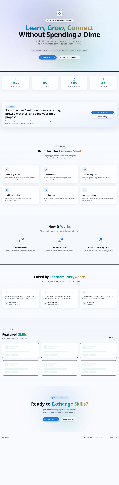

# SkillSwap — Peer-to-Peer Skill Exchange Platform

A production-grade Next.js application enabling direct 1-to-1 skill barter. Users list skills they offer, propose trades for skills they want to learn, and coordinate sessions through real-time chat — no credits, no payments, no middlemen.



---

## Overview

SkillSwap is built around a **pure exchange economy**: every interaction is a mutual agreement between two peers. Instead of booking a slot on a calendar, a learner proposes what they will teach in return for the skill they want. The teacher accepts or declines, and once accepted, a live chat room is spawned automatically so both parties can coordinate timing and details.

### Core User Flows

1. **Onboarding** — Set timezone, add 2–3 skills you offer, and skills you want to learn.
2. **Browse & Discover** — Search and filter listings by category, difficulty, and tags.
3. **Propose a Swap** — Select a listing, pick one of your own skills to offer back, set a proposed time and duration, and send a proposal.
4. **Negotiate via Chat** — When a swap is accepted, a real-time conversation room is created instantly. Users exchange messages, share availability, and confirm final details.
5. **Session & Review** — After the session, both parties leave a 1–5 star review with optional comments, building trust in the community.

---

## Architecture Highlights

- **App Router with Server Components** — Data fetching happens server-side; client components are isolated to interactive islands.
- **Server Actions** — Mutations (propose swap, accept/decline, create listing) are handled via Next.js Server Actions with automatic revalidation.
- **Supabase Realtime** — Conversations use `postgres_changes` and broadcast channels for live message delivery and typing indicators.
- **Radix UI + shadcn/ui** — Accessible, composable primitives with Tailwind CSS for styling.
- **Framer Motion** — Animated message bubbles and page transitions.
- **Zustand** — Lightweight client state: auth (`auth-store.ts`) and chat (`chat-store.ts`) with optimistic updates for offline resilience.
- **Zod** — Runtime validation on all server action inputs.

---

## Feature Set

### Skill Marketplace
- Create, edit, and deactivate skill listings
- Rich metadata: category, tags, difficulty level, estimated duration, prerequisites
- Infinite-scroll browse page with instant search and category filters
- Intercepted route modal for quick listing preview without leaving the browse flow

### Pure Barter System
- `mutual_swaps` table tracks every proposal with `pending`, `accepted`, `declined`, `completed`, or `cancelled` status
- Incoming/Outgoing proposal tabs on the sessions dashboard
- Accepting a swap auto-creates a chat room between proposer and receiver
- All session data is relational: swaps reference specific skills being exchanged

### Real-Time Communication
- Supabase Realtime subscriptions on `messages` and `conversations` tables
- Typing indicators and online presence via Supabase broadcast and presence channels
- Media upload support in chat (images, video, PDF, text files)
- Push notification service worker for background alerts

### Session Lifecycle
- Session status transitions: `PENDING` → `CONFIRMED` → `COMPLETED` / `CANCELLED`
- Teachers can confirm/decline incoming session requests
- Video call support via WebRTC signaling
- Post-session review system with 5-star ratings and comments

### Trust & Safety
- Row Level Security (RLS) on all Supabase tables with security definer functions for optimal performance
- Rate limiting on API routes via Upstash Redis
- Sentry integration for production error monitoring
- Notification system for swap requests, session changes, and new messages
- Media upload validation: 10MB limit, mime-type whitelist

### Progressive Web App
- `manifest.json` with shortcuts for Browse, Messages, and Sessions
- Service worker using Workbox strategies for offline caching
- Install prompt support on mobile and desktop

---

## Tech Stack

| Layer | Technology |
|---|---|
| Framework | Next.js 16 (App Router) |
| Language | TypeScript |
| UI Primitives | Radix UI, shadcn/ui |
| Styling | Tailwind CSS |
| Animations | Framer Motion |
| Icons | Lucide React |
| Database | Supabase (PostgreSQL) |
| Auth | Supabase Auth |
| Realtime | Supabase Realtime |
| Client State | Zustand |
| Validation | Zod |
| Notifications | Sonner |
| Rate Limiting | Upstash Redis |
| Monitoring | Sentry |

---

## Database Schema

### Core Tables

| Table | Purpose |
|---|---|
| `profiles` | User data: name, email, bio, avatar, timezone, skills offered/wanted, rating |
| `listings` | Skill listings: title, description, category, tags, difficulty, duration, availability |
| `mutual_swaps` | Barter proposals: proposer, receiver, skills being exchanged, proposed time, duration, status |
| `sessions` | Scheduled sessions derived from accepted swaps |
| `reviews` | Post-session ratings (1–5) and comments |
| `conversations` | Chat rooms linked to listings or swaps |
| `conversation_participants` | Junction table for many-to-many user ↔ conversation |
| `messages` | Chat messages with sender, content, type, read status |
| `notifications` | In-app alerts for swaps, messages, and session events |
| `availability` | Weekly time-slot rules for listings |

### Key Relationships

- `mutual_swaps.proposer_id` → `profiles.id`
- `mutual_swaps.receiver_id` → `profiles.id`
- `mutual_swaps.proposer_skill_id` → `listings.id`
- `mutual_swaps.receiver_skill_id` → `listings.id`
- `sessions.listing_id` → `listings.id`
- `conversations.listing_id` → `listings.id` (optional)
- `messages.conversation_id` → `conversations.id`

---

## API Routes

| Route | Methods | Description |
|---|---|---|
| `/api/listings` | GET, POST, PUT | Fetch, create, update listings |
| `/api/conversations` | GET, POST | List conversations, create new |
| `/api/conversations/[id]/messages` | GET, POST | Fetch/send messages |
| `/api/conversations/[id]/messages/upload` | POST | Upload media in chat |
| `/api/conversations/[id]/read` | POST | Mark messages as read |
| `/api/users/me` | GET, PUT | Fetch/update own profile |
| `/api/notifications` | GET, POST | List notifications, create |
| `/api/notifications/[id]/read` | POST | Mark single notification read |
| `/api/notifications/read-all` | POST | Mark all notifications read |
| `/api/search` | GET | Search listings, users, conversations |
| `/api/search/advanced` | GET | Advanced search with filters |
| `/api/sessions/[id]` | GET, PATCH | Fetch/update session |
| `/api/analytics` | GET | Analytics data (overview, listings, sessions, users) |
| `/api/video-call` | GET | WebRTC signaling config |

---

## Project Structure

```
src/
├── app/
│   ├── (app)/                          # Authenticated route group
│   │   ├── layout.tsx                  # App shell: Navbar + Footer
│   │   ├── browse/page.tsx             # Browse listings
│   │   ├── create-listing/page.tsx     # Create/edit listing
│   │   ├── listing/[id]/page.tsx       # Full listing detail
│   │   ├── messages/page.tsx           # Real-time chat
│   │   ├── notifications/page.tsx      # Notifications panel
│   │   ├── onboarding/page.tsx         # Profile setup wizard
│   │   ├── profile/[id]/page.tsx       # User profile
│   │   ├── session/[id]/page.tsx       # Session detail + review
│   │   └── sessions/page.tsx           # Swap proposals dashboard
│   │
│   ├── browse/(.)listing/[id]/         # Intercepted listing modal
│   ├── actions/
│   │   ├── propose-swap.ts             # Create a new barter proposal
│   │   ├── update-swap-status.ts       # Accept / decline proposals
│   │   └── listings.ts                 # Listing CRUD server actions
│   ├── api/                            # REST API routes
│   ├── globals.css                     # Tailwind + theme variables
│   └── layout.tsx                      # Root layout + PWA registration
│
├── components/
│   ├── chat/
│   │   ├── chat-list.tsx               # Conversation sidebar
│   │   └── chat-view.tsx               # Message view (Framer Motion)
│   ├── common/
│   │   ├── listing-card.tsx
│   │   ├── session-review-form.tsx     # Star rating + comment form
│   │   ├── star-rating.tsx
│   │   └── ...
│   ├── layout/
│   │   ├── navbar.tsx
│   │   └── footer.tsx
│   ├── pwa/
│   │   └── sw-register.tsx
│   ├── search/
│   │   └── search-box.tsx
│   ├── swaps/
│   │   └── swap-actions.tsx            # Accept/Reject client component
│   └── ui/                             # shadcn/ui component library
│
├── hooks/
│   ├── use-chat.ts                     # Realtime chat logic
│   └── use-mobile.ts
├── lib/
│   ├── auth-helpers.ts                 # createServerClient, getAuthUser
│   ├── supabase.ts                     # Browser client
│   ├── validators.ts                   # Zod schemas (swap proposal, listing, review)
│   └── ...
├── store/
│   ├── auth-store.ts                   # Zustand: auth state
│   ├── chat-store.ts                   # Zustand: optimistic chat state, offline retry
│   └── router-store.ts                 # Deprecated (pre-migration)
└── views/                              # Client page components
    ├── browse-page.tsx
    ├── listing-detail-page.tsx
    ├── sessions-page.tsx
    └── ...
```

---

## Local Development

### Prerequisites
- Node.js 20+ (LTS recommended)
- npm or pnpm
- A Supabase project with the SQL schema applied

### Setup

```bash
# Install dependencies
npm install

# Copy environment file
cp .env.example .env.local

# Start development server
npm run dev
```

Visit [http://localhost:3000](http://localhost:3000).

### Environment Variables

```env
# Required
NEXT_PUBLIC_SUPABASE_URL=https://your-project.supabase.co
NEXT_PUBLIC_SUPABASE_ANON_KEY=your-anon-key

# TURN Server Configuration (for WebRTC IP privacy)
# Get credentials from Twilio Network Traversal or Xirsys
TURN_USERNAME=
TURN_CREDENTIAL=
TURN_SERVERS=stun:stun.l.google.com:19302,stun:stun1.l.google.com:19302

# Optional (fail-open if missing)
UPSTASH_REDIS_REST_URL=
UPSTASH_REDIS_REST_TOKEN=
UPSTASH_REDIS_REST_PASSWORD=

# Optional (monitoring)
NEXT_PUBLIC_SENTRY_DSN=
NEXT_PUBLIC_APP_URL=http://localhost:3000
```

### Database Setup

Run the schema and policies in `supabase/schema.sql` against your Supabase database. Key steps:
1. Enable **Row Level Security** on all tables
2. Create the `swap_status` enum and `mutual_swaps` table
3. Insert RLS policies for profiles, listings, sessions, swaps, conversations, and messages
4. Enable **Realtime** on `conversations`, `messages`, and `notifications`

---

## Supabase & Demo Data

The repo is configured for a **local Supabase stack** (Docker). The `config.toml` is
CLI v2-compatible; `schema.sql` defines the schema, RLS, and role grants, and
`seed.sql` loads demo content.

```bash
# 1. Start the local stack (pulls images on first run, then applies schema/seed)
npx supabase start

# 2. Apply the schema (tables, RLS, grants) and demo data
psql "$DATABASE_URL" -f supabase/schema.sql
psql "$DATABASE_URL" -f supabase/seed.sql
```

> `npx supabase start` does **not** auto-apply `schema.sql`/`seed.sql` — run them
> manually as shown. After starting, point `.env` at the local instance:
> `NEXT_PUBLIC_SUPABASE_URL=http://127.0.0.1:54321` and the local anon key from
> `npx supabase status`.

**Demo accounts** (password for all: `Password123!`):

| Email | Name | Sample skills |
| --- | --- | --- |
| `alice@example.com` | Alice Johnson | React, TypeScript (offers) → Guitar, Spanish (wants) |
| `bob@example.com` | Bob Smith | Guitar, Music Theory |
| `carol@example.com` | Carol Williams | Indian Cooking, Baking |
| `david@example.com` | David Lee | Spanish, English |
| `emma@example.com` | Emma Davis | UI/UX Design, Figma |
| `frank@example.com` | Frank Miller | Fitness, Yoga |

The seed also creates 10 active listings (across Technology, Music, Cooking,
Language, Design, Fitness), availability slots, a couple of mutual swaps, one
scheduled session, a conversation with messages, notifications, and a review.
Re-running `seed.sql` is idempotent (fixed UUIDs + `ON CONFLICT DO NOTHING`).

---

## Scripts

```bash
npm run dev          # Start dev server (localhost:3000)
npm run build        # Production build
npm run lint         # ESLint
npx tsc --noEmit     # TypeScript type check
```

---

## Design Decisions

### Why Direct Barter?
Credit and token systems create artificial scarcity and UX overhead. A pure barter model ensures every interaction requires mutual consent, keeping the platform fair and simple.

### Why Server Actions?
Next.js Server Actions eliminate boilerplate API route handlers, provide automatic type inference, and keep mutations close to the UI that triggers them. They also make revalidation straightforward with `revalidatePath`.

### Why Supabase Realtime Instead of WebSockets?
Supabase's managed Realtime layer handles presence, broadcast, and database change streams with minimal infrastructure overhead. It scales automatically and integrates natively with the Postgres schema.

### Why Zustand?
Zustand is used intentionally for narrow client concerns (auth session state, mobile breakpoint). All routing and data fetching now uses Next.js primitives (`useRouter`, Server Components, Server Actions).

---

## Deployment

### Vercel (Recommended)
1. Push to GitHub
2. Import into Vercel
3. Set environment variables
4. Deploy

### Self-Hosted
Standard Next.js output — compatible with Docker, AWS Amplify, Google Cloud Run, DigitalOcean App Platform, or any Node.js host.

### Production Checklist
- [ ] Set `NEXT_PUBLIC_APP_URL` to your production domain
- [ ] Configure Supabase Auth redirect URLs
- [ ] Add TURN/STUN servers for WebRTC video calls (`TURN_USERNAME`, `TURN_CREDENTIAL`, `TURN_SERVERS`)
- [ ] Enable Sentry for error tracking
- [ ] Configure Upstash Redis for rate limiting
- [ ] Set `NEXTAUTH_SECRET` to a strong random value
- [ ] Verify PWA manifest icons are served over HTTPS
- [ ] Enable Supabase PITR backup (Pro tier recommended for transactional data)
- [ ] Enable MFA for project in Supabase dashboard
- [ ] Run `npx supabase status` to verify all tables have RLS enabled

---

## Brand Assets

The SkillSwap logo uses a gradient mark (two interlocking arrows representing skill exchange) over the brand indigo → cyan → purple gradient.

| File | Purpose |
| --- | --- |
| `public/logo.svg` | Full lockup (mark + "SkillSwap" wordmark) for navbar/footer |
| `public/logo-mark.svg` | Icon-only mark, used as the SVG favicon |
| `public/icon-192x192.png` | PWA/app icon (192×192) |
| `public/icon-512x512.png` | PWA/app icon (512×512) |

---

## Contributing

1. Fork the repository
2. Create a feature branch: `git checkout -b feature/my-feature`
3. Install dependencies: `npm install`
4. Make your changes
5. Run lint and type check:
   ```bash
   npm run lint
   npx tsc --noEmit
   ```
6. Commit and push
7. Open a pull request

---

## License

MIT
